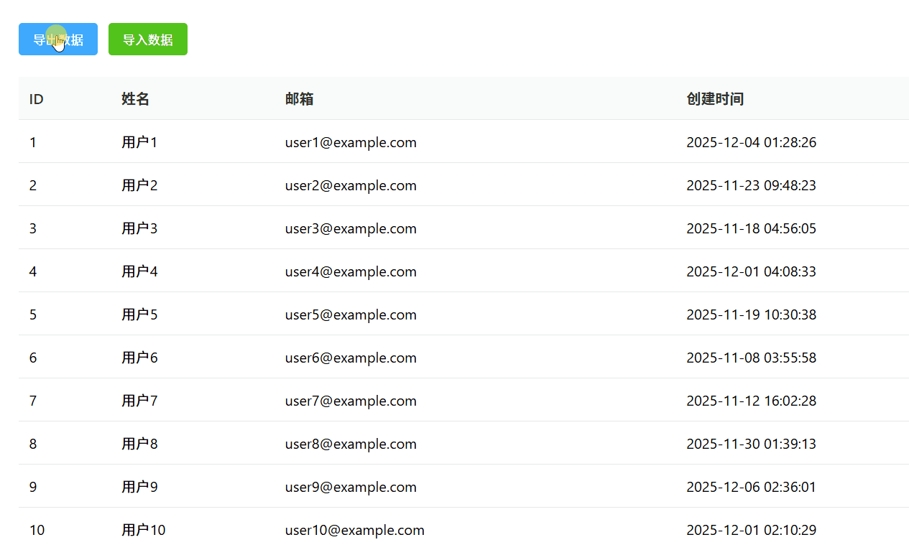
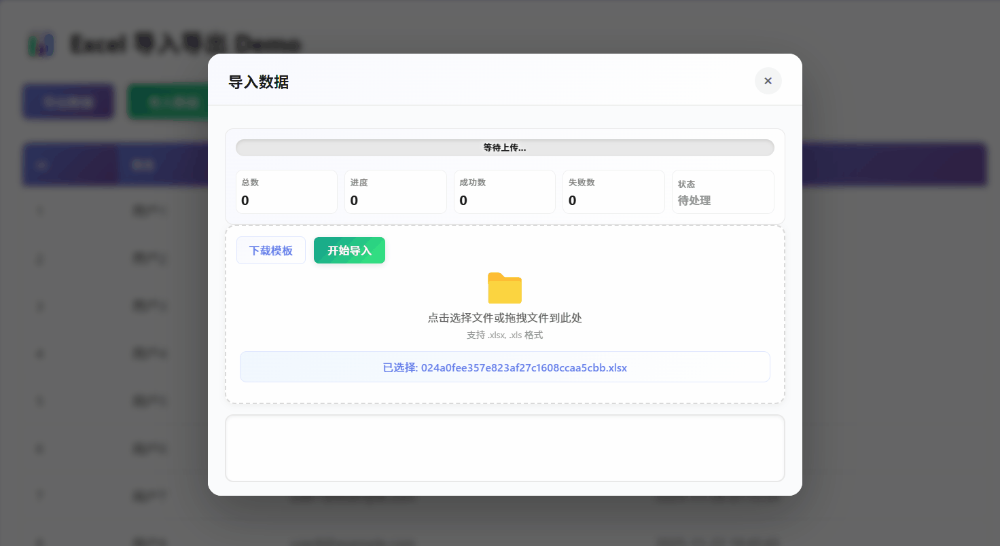
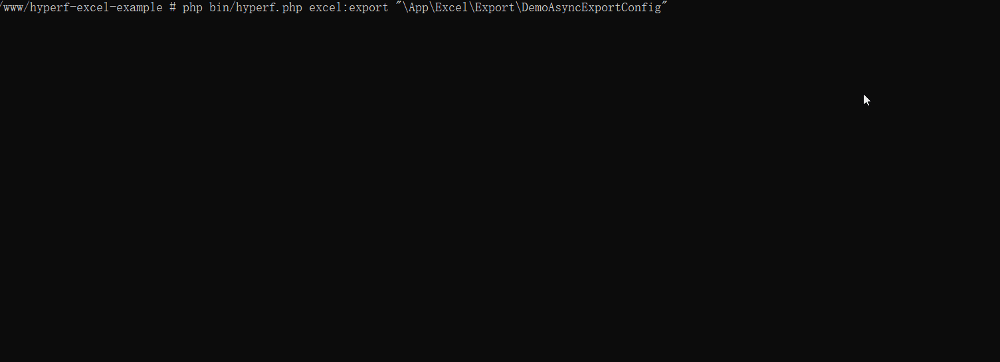

# Hyperf Excel 使用示例

这是一个基于 [vartruexuan/hyperf-excel](https://github.com/businessg/hyperf-excel) 包的完整使用示例项目，演示了如何在 Hyperf 框架中使用 Excel 导入导出功能。

## ✨ 功能特性

- ✅ **异步导出**：支持大数据量异步导出，实时进度显示
- ✅ **命令行导出**：支持通过命令行直接执行导出任务
- ✅ **数据导入**：支持 Excel 文件导入，带进度追踪和错误提示
- ✅ **实时进度**：进度条、总数、成功数、失败数实时更新
- ✅ **消息输出**：处理过程中的消息实时展示
- ✅ **拖拽上传**：支持文件拖拽上传，操作更便捷
- ✅ **模板下载**：一键下载导入模板

## 📸 效果预览

### 导出功能演示



导出功能支持异步处理，实时显示进度信息，包括总数、进度、成功数、失败数和当前状态。

### 导入功能演示



导入功能支持点击选择或拖拽上传文件，实时显示处理进度和消息输出。

### 命令行导出演示



命令行导出功能支持通过终端直接执行导出任务，适合定时任务、批量处理等场景。

## 📦 包安装

### 安装 hyperf-excel 包

```bash
composer require vartruexuan/hyperf-excel:~1.3.0
```

**注意：本项目使用的包版本为 `~1.3.0`**

## 🚀 快速开始

### 访问 Demo 页面

启动项目后，访问以下地址查看演示页面：

```
http://你的域名/demo/index
```

Demo 页面提供了完整的 Excel 导入导出功能演示，包括：
- 异步导出（带进度条和实时状态）
- 数据导入（支持拖拽上传，带进度追踪）
- 实时进度查询（总数、进度、成功数、失败数、状态）
- 消息输出（处理过程中的实时消息）

## 📡 API 接口

### Excel 相关接口

所有 Excel 相关接口都在 `/excel` 路由组下：

| 接口路径 | 请求方法 | 说明 | 参数 |
|---------|---------|------|------|
| `/excel/export` | GET/POST | 导出数据 | `businessId`: 业务ID<br>`param`: 导出参数（JSON） |
| `/excel/import` | POST | 导入数据 | `businessId`: 业务ID<br>`url`: 文件URL |
| `/excel/progress` | GET | 查询进度 | `token`: 任务token |
| `/excel/message` | GET | 查询消息 | `token`: 任务token |
| `/excel/info` | GET | 获取业务信息 | `businessId`: 业务ID |

**接口说明：**
- `export`: 创建导出任务，支持同步和异步两种模式
- `import`: 创建导入任务，需要先上传文件获取 URL
- `progress`: 查询任务进度，返回总数、进度、成功数、失败数、状态等信息
- `message`: 查询任务消息，返回处理过程中的消息列表
- `info`: 获取业务配置信息，包括模板下载地址等

### Demo 相关接口

| 接口路径 | 请求方法 | 说明 | 参数 |
|---------|---------|------|------|
| `/demo/index` | GET | Demo 首页视图 | - |
| `/demo/list` | GET | 数据列表API | - |
| `/demo/upload` | POST | 文件上传 | `file`: 文件（multipart/form-data） |

**接口说明：**
- `index`: 返回 Demo 演示页面 HTML
- `list`: 返回数据列表，用于页面数据展示和刷新
- `upload`: 文件上传接口，返回文件相对路径

## 📁 代码文件结构

### 主要文件说明

```
hyperf-excel-example/
├── app/
│   ├── Controller/                    # 控制器目录
│   │   ├── ExcelController.php       # Excel 功能控制器（导出、导入、进度查询等）
│   │   └── DemoController.php        # Demo 演示控制器（页面渲染、文件上传）
│   │
│   ├── Service/                       # 服务层目录
│   │   ├── ExcelLogService.php       # Excel 业务服务（封装包的核心功能）
│   │   └── FileService.php            # 文件服务（文件上传、路径处理）
│   │
│   ├── Excel/                         # Excel 配置目录
│   │   ├── Export/                    # 导出配置
│   │   │   ├── Base/
│   │   │   │   └── AbstractExportConfig.php  # 导出配置基类
│   │   │   ├── DemoExportConfig.php          # Demo 同步导出配置
│   │   │   ├── DemoAsyncExportConfig.php     # Demo 异步导出配置（50000条数据，分页1000，延迟600ms）
│   │   │   └── DemoImportTemplateExportConfig.php  # Demo 导入模板导出配置
│   │   │
│   │   └── Import/                    # 导入配置
│   │       ├── Base/
│   │       │   └── AbstractImportConfig.php  # 导入配置基类
│   │       └── DemoImportConfig.php          # Demo 导入配置
│   │
│   ├── Http/                          # HTTP 请求验证
│   │   └── Request/
│   │       └── ExcelRequest.php       # Excel 请求验证类
│   │
│   └── View/                          # 视图目录
│       └── demo/
│           └── index.php              # Demo 演示页面（包含完整的导入导出UI）
│
├── config/
│   └── autoload/
│       ├── excel.php                 # Excel 包基础配置（驱动、队列、进度等）
│       ├── excel_business.php        # Excel 业务配置（导出/导入业务ID映射）
│       └── file.php                   # 文件存储配置（本地、OSS、COS等）
│
└── config/
    └── routes.php                     # 路由配置
```

## 🔧 核心文件说明

### 1. 控制器层

#### `app/Controller/ExcelController.php`
Excel 功能的核心控制器，提供以下功能：
- **export()**: 导出接口，支持同步和异步导出
- **import()**: 导入接口，处理 Excel 文件导入
- **progress()**: 进度查询接口，返回任务进度信息
- **message()**: 消息查询接口，返回任务处理消息
- **info()**: 业务信息接口，获取业务配置信息

#### `app/Controller/DemoController.php`
Demo 演示控制器：
- **index()**: 渲染 Demo 首页视图
- **list()**: 返回数据列表（用于 AJAX 刷新）
- **upload()**: 文件上传接口，用于导入功能

### 2. 服务层

#### `app/Service/ExcelLogService.php`
Excel 业务服务，封装了 hyperf-excel 包的核心功能：
- **exportByBusinessId()**: 根据业务ID执行导出
- **importByBusinessId()**: 根据业务ID执行导入
- **getProgressArrayByToken()**: 获取进度数组（包含总数、进度、成功数、失败数、状态）
- **getMessageByToken()**: 获取消息列表（包含 isEnd 标识）

#### `app/Service/FileService.php`
文件服务，处理文件上传和路径管理：
- **upload()**: 文件上传，返回相对路径（格式：`/upload/年/月/日/文件名`）
- **getRelativePath()**: 生成文件相对路径
- **buildFileDir()**: 构建文件目录（年/月/日）
- **buildFileName()**: 生成唯一文件名

### 3. 配置文件

#### `config/autoload/excel.php`
Excel 包的基础配置：
- **default**: 默认驱动（xlswriter）
- **drivers**: 驱动配置
- **queue**: 队列配置
- **progress**: 进度处理配置
- **dbLog**: 数据库日志配置

#### `config/autoload/excel_business.php`
Excel 业务配置，定义导出和导入的业务ID映射：
```php
'export' => [
    'demoAsyncExport' => [
        'config' => \App\Excel\Export\DemoAsyncExportConfig::class,
    ],
],
'import' => [
    'demoImport' => [
        'config' => \App\Excel\Import\DemoImportConfig::class,
        'info' => [
            'templateBusinessId' => 'demoImportTemplate',
        ],
    ],
],
```

#### `config/autoload/file.php`
文件存储配置：
- **default**: 默认存储（local）
- **storage**: 存储配置（local、OSS、COS、FTP等）
- **download**: 下载域名配置

### 4. Excel 配置类

#### `app/Excel/Export/DemoAsyncExportConfig.php`
异步导出配置示例：
- **serviceName**: 服务名称
- **isAsync**: 是否异步（true）
- **outPutType**: 输出类型（OUT_PUT_TYPE_UPLOAD）
- **getSheets()**: 定义 Sheet 和列配置
- **getDataCount()**: 返回数据总数（50000）
- **getData()**: 分页获取数据（每页1000条，延迟600ms）

#### `app/Excel/Import/DemoImportConfig.php`
导入配置示例：
- **serviceName**: 服务名称
- **getSheets()**: 定义 Sheet 和列配置
- **rowCallback()**: 行回调处理，验证和处理每行数据

#### `app/Excel/Export/Base/AbstractExportConfig.php`
导出配置基类，提供通用功能。

#### `app/Excel/Import/Base/AbstractImportConfig.php`
导入配置基类，提供通用功能。

## 📊 数据结构

### 进度接口返回格式

```json
{
    "code": 0,
    "msg": "success",
    "data": {
        "sheetListProgress": {
            "sheet1": {
                "total": 50000,
                "progress": 1000,
                "success": 1000,
                "fail": 0,
                "status": 2,
                "message": ""
            }
        },
        "progress": {
            "total": 50000,      // 总数据量
            "progress": 1000,    // 已处理数量
            "success": 1000,     // 成功数量
            "fail": 0,           // 失败数量
            "status": 2,         // 状态码
            "message": ""        // 状态消息
        },
        "data": {
            "response": "/upload/export/xxx.xlsx"  // 导出文件路径（完成时返回）
        }
    }
}
```

### 状态码说明

| 状态值 | 状态名称 | 说明 | UI 显示 |
|-------|---------|------|---------|
| 1 | 待处理 | 任务已创建，等待处理 | 灰色 |
| 2 | 处理中 | 正在处理数据 | 蓝色 |
| 3 | 处理完成 | 数据处理完成，可能正在输出 | 绿色 |
| 4 | 处理失败 | 处理过程中出现错误 | 红色 |
| 5 | 正在输出 | 正在生成和输出文件 | 橙色 |
| 6 | 完成 | 任务全部完成 | 绿色 |

### 消息接口返回格式

```json
{
    "code": 0,
    "msg": "success",
    "data": {
        "isEnd": true,                    // 消息是否结束
        "message": [                      // 消息列表
            "开始处理数据...",
            "已处理 1000 条数据",
            "处理完成",
            "导出成功"
        ]
    }
}
```

**说明：**
- `isEnd`: 当为 `true` 时，表示消息已全部输出，可以停止轮询
- `message`: 消息数组，按时间顺序排列，最新的消息在最后

## 🎯 使用示例

### 导出数据流程

1. **创建导出任务**
```javascript
const response = await fetch('/excel/export', {
    method: 'POST',
    headers: { 'Content-Type': 'application/json' },
    body: JSON.stringify({
        businessId: 'demoAsyncExport',
        param: {}
    })
});
const result = await response.json();
const token = result.data.token; // 保存 token 用于查询进度
```

2. **轮询查询进度**
```javascript
// 每秒查询一次进度
const progressInterval = setInterval(async () => {
    const response = await fetch(`/excel/progress?token=${token}`);
    const result = await response.json();
    const progress = result.data.progress;
    
    // 更新 UI：总数、进度、成功数、失败数、状态
    updateProgressUI(progress);
    
    // 如果状态为 4（失败）或 6（完成），停止轮询
    if (progress.status === 4 || progress.status === 6) {
        clearInterval(progressInterval);
    }
}, 1000);
```

3. **轮询查询消息**
```javascript
// 每秒查询一次消息
const messageInterval = setInterval(async () => {
    const response = await fetch(`/excel/message?token=${token}`);
    const result = await response.json();
    
    // 显示消息
    result.data.message.forEach(msg => {
        addMessage(msg);
    });
    
    // 如果 isEnd 为 true，停止轮询
    if (result.data.isEnd) {
        clearInterval(messageInterval);
    }
}, 1000);
```

### 导入数据流程

1. **上传文件**
```javascript
const formData = new FormData();
formData.append('file', file);
const uploadResponse = await fetch('/demo/upload', {
    method: 'POST',
    body: formData
});
const uploadResult = await uploadResponse.json();
const fileUrl = uploadResult.data.filePath; // 获取文件 URL
```

2. **创建导入任务**
```javascript
const response = await fetch('/excel/import', {
    method: 'POST',
    headers: { 'Content-Type': 'application/json' },
    body: JSON.stringify({
        businessId: 'demoImport',
        url: fileUrl
    })
});
const result = await response.json();
const token = result.data.token; // 保存 token
```

3. **查询进度和消息**（同导出流程）

### 命令行导出

通过命令行直接执行导出任务，适合定时任务、批量处理等场景：

```bash
php bin/hyperf.php excel:export "\App\Excel\Export\DemoAsyncExportConfig"
```

**命令说明：**
- `excel:export`: Excel 导出命令
- 参数：导出配置类的完整命名空间路径（需要加引号）

**使用场景：**
- 定时任务（Crontab）
- 批量数据处理
- 后台任务执行
- 脚本自动化

**注意事项：**
- 配置类必须实现导出配置接口
- 如果配置为异步导出，任务会在后台队列中执行
- 导出完成后，文件会保存到配置的输出路径

## 🛠️ 技术栈

- **后端框架**: Hyperf 3.x
- **Excel 处理**: vartruexuan/hyperf-excel ~1.3.0
- **前端技术**: 原生 JavaScript + CSS3
- **队列**: Hyperf Async Queue
- **缓存**: Redis

## 🔗 相关链接

- [Hyperf 官方文档](https://hyperf.wiki/)
- [hyperf-excel 包](https://github.com/businessg/hyperf-excel)
- [Hyperf Async Queue](https://hyperf.wiki/3.1/#/zh-cn/async-queue)

## 📄 License

本项目采用 MIT 许可证，详见 [LICENSE](LICENSE) 文件。
