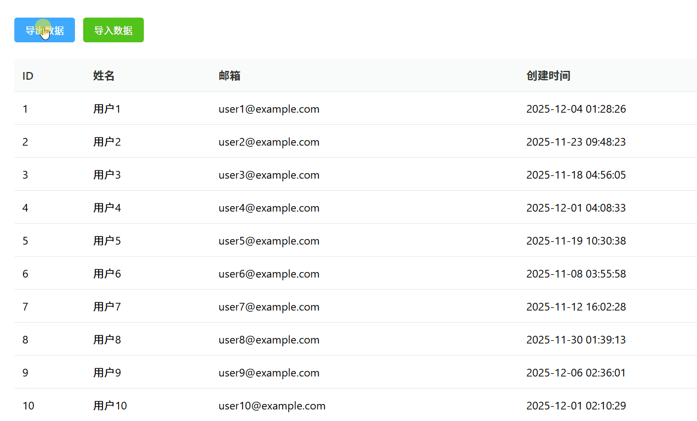
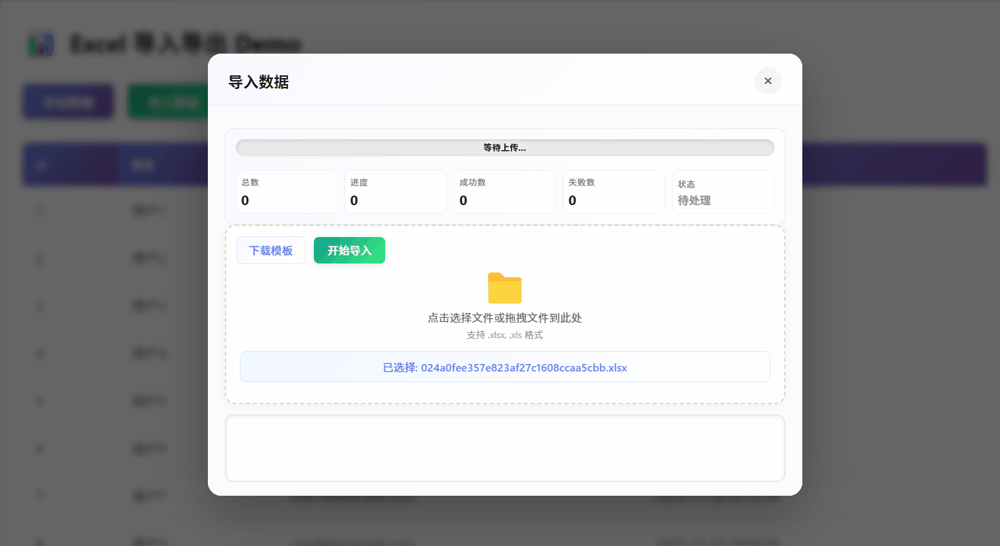
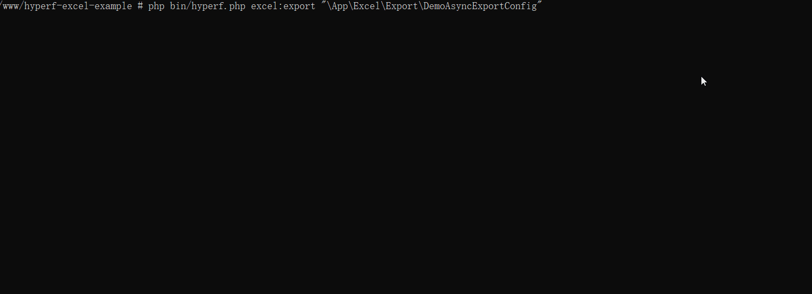

# Hyperf Excel 使用示例

基于 [businessg/hyperf-excel](https://github.com/businessg/hyperf-excel) 组件的完整使用示例项目，演示如何在 Hyperf 框架中**零代码**实现 Excel 导入导出功能。

本项目采用**组件模式**：所有 Excel HTTP 接口（导出、导入、进度查询、消息查询、文件上传）均由组件自动注册，项目中无需编写 Controller 和 Service，只需配置即可使用。

## 功能特性

- 异步导出：大数据量异步导出，实时进度显示
- 同步导出：同步生成文件并返回路径，或浏览器直接下载
- 数据导入：Excel 文件导入，逐行校验，带进度追踪
- 实时进度：进度条、总数、成功数、失败数实时更新
- 消息输出：处理过程中的消息实时展示
- 拖拽上传：支持文件拖拽上传
- 模板下载：一键下载导入模板
- CLI 命令：通过命令行直接执行导出/导入

## 效果预览

### 导出功能



### 导入功能



### 命令行导出



---

## 环境要求

| 依赖 | 版本 |
|---|---|
| PHP | >= 8.1 |
| Hyperf | ~3.1 |
| ext-xlswriter | * (pecl install xlswriter) |
| ext-redis | * |
| Swoole / Swow | Hyperf 运行时 |
| MySQL | 5.7+ |
| Redis | 运行中 |

---

## 快速开始

### 1. 克隆项目

```bash
git clone https://github.com/businessg/hyperf-excel-example.git
cd hyperf-excel-example
```

### 2. 安装依赖

```bash
composer install
```

### 3. 配置环境变量

复制 `.env.example` 为 `.env`（或直接编辑 `.env`），配置数据库和 Redis：

```env
DB_DRIVER=mysql
DB_HOST=127.0.0.1
DB_PORT=3306
DB_DATABASE=your_database
DB_USERNAME=root
DB_PASSWORD=your_password
DB_CHARSET=utf8mb4
DB_COLLATION=utf8mb4_unicode_ci

REDIS_HOST=127.0.0.1
REDIS_AUTH=
REDIS_PORT=6379
REDIS_DB=0

APP_URL=http://127.0.0.1:9501
```

### 4. 创建数据库表

执行 SQL 创建 `excel_log` 表（用于操作日志记录）：

```sql
CREATE TABLE `excel_log` (
    `id` bigint unsigned NOT NULL AUTO_INCREMENT,
    `token` varchar(64) NOT NULL DEFAULT '',
    `type` enum('export','import') NOT NULL DEFAULT 'export',
    `config_class` varchar(250) NOT NULL DEFAULT '',
    `config` json DEFAULT NULL,
    `service_name` varchar(20) NOT NULL DEFAULT '',
    `sheet_progress` json DEFAULT NULL,
    `progress` json DEFAULT NULL,
    `status` tinyint unsigned NOT NULL DEFAULT '1',
    `data` json NOT NULL,
    `remark` varchar(500) NOT NULL DEFAULT '',
    `url` varchar(300) NOT NULL DEFAULT '',
    `created_at` timestamp NOT NULL DEFAULT CURRENT_TIMESTAMP,
    `updated_at` timestamp NOT NULL DEFAULT CURRENT_TIMESTAMP ON UPDATE CURRENT_TIMESTAMP,
    PRIMARY KEY (`id`),
    UNIQUE KEY `uniq_token` (`token`)
) ENGINE=InnoDB COMMENT='导入导出日志';
```

如不需要数据库日志，可在 `config/autoload/excel.php` 中关闭：

```php
'dbLog' => [
    'enabled' => false,
],
```

### 5. 启动服务

```bash
php bin/hyperf.php start
```

### 6. 访问 Demo 页面

浏览器打开：

```
http://127.0.0.1:9501/demo/index
```

---

## 项目结构

```
hyperf-excel-example/
├── app/
│   ├── Controller/
│   │   ├── DemoController.php         # Demo 页面控制器（视图渲染、文件上传）
│   │   └── IndexController.php        # 首页
│   │
│   ├── Excel/                          # 项目自定义的 Excel 配置（可选）
│   │   ├── Export/
│   │   │   ├── DemoAsyncExportConfig.php      # 自定义异步导出配置
│   │   │   ├── DemoExportConfig.php           # 自定义同步导出配置
│   │   │   ├── DemoImportTemplateExportConfig.php
│   │   │   └── Base/AbstractExportConfig.php
│   │   └── Import/
│   │       ├── DemoImportConfig.php           # 自定义导入配置
│   │       └── Base/AbstractImportConfig.php
│   │
│   ├── Service/
│   │   └── FileService.php            # 文件上传服务（Demo 页面使用）
│   │
│   └── View/
│       └── demo/
│           └── index.php              # Demo 演示页面（完整 UI）
│
├── config/
│   └── autoload/
│       ├── excel.php                  # 组件核心配置（驱动、队列、进度、HTTP 等）
│       ├── excel_business.php         # 业务导入导出配置（business_id → Config 类映射）
│       ├── exceptions.php             # 异常处理器配置（需将 ExcelExceptionHandler 放在最前）
│       ├── async_queue.php            # 异步队列配置
│       └── redis.php                  # Redis 配置
│
└── config/
    └── routes.php                     # 路由配置（仅 Demo 页面路由）
```

> **注意**：`/excel/*` 路由由组件自动注册，不在 `routes.php` 中，无需手动配置。

---

## 配置文件详解

### config/autoload/excel.php

组件核心配置，关键项说明：

```php
return [
    'default' => 'xlswriter',

    'drivers' => [
        'xlswriter' => [
            'class' => \BusinessG\BaseExcel\Driver\XlsWriterDriver::class,
            'disk' => 'local',
            'exportDir' => 'export',
            'tempDir' => null,
        ],
    ],

    'logging' => [
        'channel' => 'hyperf-excel',    // 需在 logger.php 中配置对应 channel
    ],

    'queue' => [
        'connection' => 'default',       // 对应 async_queue.php 中的 key
        'channel' => 'default',
    ],

    'progress' => [
        'enabled' => true,
        'prefix' => 'HyperfExcel',
        'ttl' => 3600,
        'connection' => 'default',       // 对应 redis.php 中的 pool name
    ],

    'dbLog' => [
        'enabled' => true,
        'model' => \BusinessG\HyperfExcel\Db\Model\ExcelLog::class,
    ],

    'cleanup' => [
        'enabled' => true,
        'maxAge' => 1800,
        'interval' => 3600,
    ],

    // 核心：启用 HTTP 路由自动注册
    'http' => [
        'enabled' => true,               // 必须设为 true
        'prefix' => '',                  // 路由前缀（空 = /excel/export）
        'middleware' => [],              // 中间件数组
        'domain' => \Hyperf\Support\env('APP_URL', 'http://localhost:9501'),
        'codeField' => 'code',
        'dataField' => 'data',
        'messageField' => 'message',
        'successCode' => 0,
    ],
];
```

### config/autoload/excel_business.php

业务配置，注册所有可用的导入导出 business_id。本项目使用组件内置 Demo 配置：

```php
return [
    'export' => [
        'demoExport'          => ['config' => \BusinessG\BaseExcel\Demo\DemoExportConfig::class],
        'demoExportOut'       => ['config' => \BusinessG\BaseExcel\Demo\DemoExportOutConfig::class],
        'demoAsyncExport'     => ['config' => \BusinessG\BaseExcel\Demo\DemoAsyncExportConfig::class],
        'demoExportForImport' => ['config' => \BusinessG\BaseExcel\Demo\DemoExportForImportConfig::class],
        'demoImportTemplate'  => ['config' => \BusinessG\BaseExcel\Demo\DemoImportTemplateExportConfig::class],
    ],
    'import' => [
        'demoImport' => [
            'config' => \BusinessG\BaseExcel\Demo\DemoImportConfig::class,
            'info' => [
                'templateBusinessId' => 'demoImportTemplate',
            ],
        ],
    ],
];
```

### config/autoload/exceptions.php

**关键**：`ExcelExceptionHandler` 必须放在通用处理器之前：

```php
return [
    'handler' => [
        'http' => [
            BusinessG\HyperfExcel\Exception\Handler\ExcelExceptionHandler::class,
            Hyperf\HttpServer\Exception\Handler\HttpExceptionHandler::class,
            App\Exception\Handler\AppExceptionHandler::class,
        ],
    ],
];
```

---

## 接口说明

### 组件自动注册的 Excel 接口

以下接口由 `businessg/hyperf-excel` 组件自动注册（`http.enabled = true` 时生效）：

| 方法 | 路径 | 参数 | 说明 |
|---|---|---|---|
| GET/POST | `/excel/export` | `business_id`, `param`(可选) | 触发导出 |
| POST | `/excel/import` | `business_id`, `url` | 触发导入 |
| GET | `/excel/progress` | `token` | 查询进度 |
| GET | `/excel/message` | `token` | 获取消息 |
| GET | `/excel/info` | `business_id` | 获取导入附加信息 |
| POST | `/excel/upload` | `file` (multipart) | 上传 Excel 文件 |

### Demo 页面接口

以下接口由项目自身 `DemoController` 提供：

| 方法 | 路径 | 说明 |
|---|---|---|
| GET | `/demo/index` | Demo 演示页面 |
| GET | `/demo/list` | 数据列表 API（AJAX 刷新） |
| POST | `/demo/upload` | Demo 文件上传（返回 filePath） |

### 响应格式

```json
// 成功
{"code": 0, "data": {...}, "message": ""}

// 失败
{"code": 500, "data": null, "message": "错误信息"}
```

---

## 使用示例

### 同步导出（返回文件路径）

```bash
curl -X POST http://127.0.0.1:9501/excel/export \
  -H "Content-Type: application/json" \
  -d '{"business_id": "demoExport"}'
```

返回：

```json
{"code": 0, "data": {"token": "xxx", "response": "/path/to/export/file.xlsx"}, "message": ""}
```

### 同步导出（浏览器直接下载）

浏览器访问：

```
http://127.0.0.1:9501/excel/export?business_id=demoExportOut
```

直接触发文件下载。

### 异步导出（大数据量）

```bash
# 1. 创建异步导出任务
curl -X POST http://127.0.0.1:9501/excel/export \
  -H "Content-Type: application/json" \
  -d '{"business_id": "demoAsyncExport"}'
# → {"code":0,"data":{"token":"abc123","response":null}}

# 2. 轮询进度（每秒一次，直到 status=6 完成或 status=4 失败）
curl "http://127.0.0.1:9501/excel/progress?token=abc123"

# 3. 轮询消息
curl "http://127.0.0.1:9501/excel/message?token=abc123"
```

### 导入流程

```bash
# 1. 获取导入信息（含模板地址）
curl "http://127.0.0.1:9501/excel/info?business_id=demoImport"
# → {"code":0,"data":{"templateUrl":"http://127.0.0.1:9501/excel/export?business_id=demoImportTemplate"}}

# 2. 上传 Excel 文件
curl -X POST http://127.0.0.1:9501/excel/upload -F "file=@test.xlsx"
# → {"code":0,"data":{"path":"/runtime/excel-import/2026/03/10/xxx.xlsx","url":"..."}}

# 3. 执行导入
curl -X POST http://127.0.0.1:9501/excel/import \
  -H "Content-Type: application/json" \
  -d '{"business_id": "demoImport", "url": "/runtime/excel-import/2026/03/10/xxx.xlsx"}'

# 4. 轮询进度和消息（同导出）
```

### CLI 命令

```bash
# 导出
php bin/hyperf.php excel:export "BusinessG\BaseExcel\Demo\DemoExportConfig"

# 导入
php bin/hyperf.php excel:import "BusinessG\BaseExcel\Demo\DemoImportConfig" "/path/to/file.xlsx"

# 查询进度
php bin/hyperf.php excel:progress {token}

# 查询消息
php bin/hyperf.php excel:message {token}
```

---

## 进度状态码

| 状态值 | 名称 | 说明 |
|---|---|---|
| 1 | 待处理 | 任务已创建，等待处理 |
| 2 | 处理中 | 正在处理数据 |
| 3 | 处理完成 | 数据处理完成 |
| 4 | 处理失败 | 处理过程中出错 |
| 5 | 正在输出 | 正在生成文件 |
| 6 | 完成 | 全部完成 |

---

## 内置 Demo 配置

| business_id | 同步/异步 | 输出方式 | 说明 |
|---|---|---|---|
| `demoExport` | 同步 | UPLOAD | 100 条数据，返回文件路径 |
| `demoExportOut` | 同步 | OUT | 20 条数据，浏览器直接下载 |
| `demoAsyncExport` | 异步 | UPLOAD | 5 万条数据，带进度消息 |
| `demoExportForImport` | 同步 | UPLOAD | 5 条测试数据，供导入测试 |
| `demoImportTemplate` | 同步 | OUT | 带样式的导入模板 |
| `demoImport` | 同步 | — | 逐行校验 + 消息推送 |

---

## 技术栈

- Hyperf 3.x
- businessg/hyperf-excel（组件模式，自动注册路由）
- businessg/base-excel（核心库）
- Hyperf Async Queue（异步任务）
- Redis（进度追踪）
- 原生 JavaScript + CSS3（Demo UI）

## 相关链接

- [hyperf-excel 组件文档](https://github.com/businessg/hyperf-excel)
- [base-excel 核心库](https://github.com/businessg/base-excel)
- [Hyperf 官方文档](https://hyperf.wiki/)

## License

MIT
