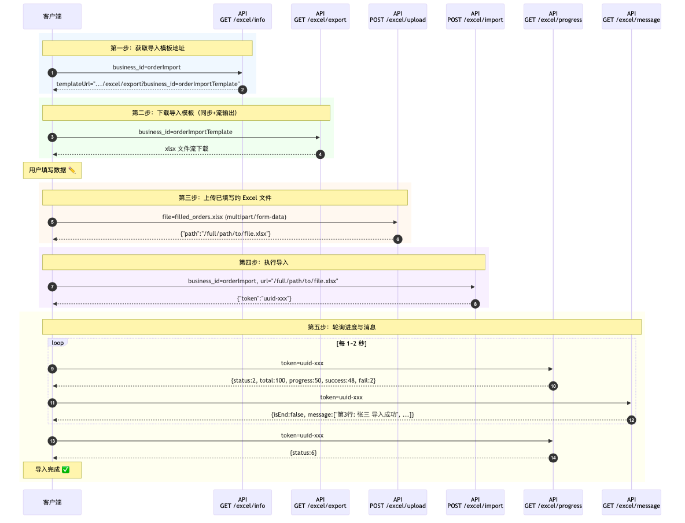

# hyperf-excel-example

基于 [businessg/hyperf-excel](https://github.com/businessg/hyperf-excel) 组件的完整示例项目。展示**零代码模式**——仅通过配置即可实现同步/异步导入导出，无需编写 Controller 或 Service。

## 效果预览

### 导出功能


### 导入功能


### 命令行导出


---

## 目录

- [1. 环境要求与安装](#1-环境要求与安装)
- [2. 项目结构](#2-项目结构)
- [3. 配置说明](#3-配置说明)
  - [3.1 excel.php — 组件核心配置](#31-excelphp--组件核心配置)
  - [3.2 excel_business.php — 业务配置](#32-excel_businessphp--业务配置)
  - [3.3 exceptions.php — 异常处理器](#33-exceptionsphp--异常处理器)
  - [3.4 listeners.php — 事件监听器](#34-listenersphp--事件监听器)
- [4. API 接口参考](#4-api-接口参考)
- [5. 快速上手](#5-快速上手)
  - [5.1 同步导出](#51-同步导出)
  - [5.2 浏览器直接下载导出](#52-浏览器直接下载导出)
  - [5.3 异步导出](#53-异步导出)
  - [5.4 完整导入流程](#54-完整导入流程)
- [6. Demo UI 页面](#6-demo-ui-页面)
- [7. 流程图](#7-流程图)
- [8. 常见问题](#8-常见问题)

---

## 1. 环境要求与安装

### 1.1 环境要求

| 依赖 | 版本 | 说明 |
|---|---|---|
| PHP | >= 8.1 | |
| Swoole | >= 5.0 | |
| Hyperf | 3.x | |
| ext-xlswriter | * | `pecl install xlswriter` |
| ext-redis | * | |
| Redis 服务 | 任意版本 | |
| MySQL | 5.7+ | 启用 dbLog 时需要 |

### 1.2 安装

```bash
git clone https://github.com/businessg/hyperf-excel-example.git
cd hyperf-excel-example

composer install
```

### 1.3 配置环境变量

编辑 `.env`：

```env
APP_NAME=hyperf-excel-example
APP_URL=http://localhost:9501

# MySQL（启用 dbLog 时需要）
DB_HOST=127.0.0.1
DB_PORT=3306
DB_DATABASE=hyperf_excel_example
DB_USERNAME=root
DB_PASSWORD=

# Redis（进度追踪 + 异步队列）
REDIS_HOST=127.0.0.1
REDIS_PORT=6379
REDIS_AUTH=
REDIS_DB=0
```

### 1.4 建表（可选，启用 dbLog 时需要）

```sql
CREATE TABLE `excel_log` (
    `id`              bigint unsigned NOT NULL AUTO_INCREMENT,
    `token`           varchar(64)  NOT NULL DEFAULT '',
    `type`            enum('export','import') NOT NULL DEFAULT 'export',
    `config_class`    varchar(250) NOT NULL DEFAULT '',
    `config`          json         DEFAULT NULL,
    `service_name`    varchar(20)  NOT NULL DEFAULT '',
    `sheet_progress`  json         DEFAULT NULL,
    `progress`        json         DEFAULT NULL,
    `status`          tinyint unsigned NOT NULL DEFAULT '1',
    `data`            json         NOT NULL,
    `remark`          varchar(500) NOT NULL DEFAULT '',
    `url`             varchar(300) NOT NULL DEFAULT '',
    `created_at`      timestamp    NOT NULL DEFAULT CURRENT_TIMESTAMP,
    `updated_at`      timestamp    NOT NULL DEFAULT CURRENT_TIMESTAMP ON UPDATE CURRENT_TIMESTAMP,
    PRIMARY KEY (`id`),
    UNIQUE KEY `uniq_token` (`token`)
) ENGINE=InnoDB COMMENT='导入导出日志';
```

### 1.5 启动服务

```bash
php bin/hyperf.php start
```

服务启动后监听 `http://localhost:9501`。

---

## 2. 项目结构

```
hyperf-excel-example/
├── app/
│   └── View/demo/index.php       ← Demo UI 页面
├── config/
│   └── autoload/
│       ├── excel.php              ← 组件核心配置
│       ├── excel_business.php     ← 业务配置（注册导入导出）
│       ├── exceptions.php         ← 异常处理器
│       └── listeners.php          ← 事件监听器（路由注册）
├── .env
└── composer.json
```

> **零代码模式**：项目中不包含任何 ExcelController 或 ExcelService。
> 所有导入导出逻辑由 `businessg/hyperf-excel` 组件自动注册和处理。
> 所有 Demo 配置类均来自 `businessg/base-excel` 的 `Demo/` 目录。

---

## 3. 配置说明

### 3.1 excel.php — 组件核心配置

```php
<?php
// config/autoload/excel.php

declare(strict_types=1);

return [
    // 默认驱动
    'default' => 'xlswriter',

    // 驱动配置
    'drivers' => [
        'xlswriter' => [
            'class'     => \BusinessG\BaseExcel\Driver\XlsWriterDriver::class,
            'disk'      => 'local',
            'exportDir' => 'export',
            'tempDir'   => null,
        ],
    ],

    // 日志通道
    'logging' => [
        'channel' => 'default',
    ],

    // 异步队列
    'queue' => [
        'connection' => 'default',
        'channel'    => 'default',
    ],

    // Redis 进度追踪
    'progress' => [
        'enabled'    => true,
        'prefix'     => 'HyperfExcel',
        'ttl'        => 3600,
        'connection' => 'default',
    ],

    // 数据库日志
    'dbLog' => [
        'enabled' => true,
        'model'   => \BusinessG\HyperfExcel\Db\Model\ExcelLog::class,
    ],

    // 临时文件清理
    'cleanup' => [
        'enabled'  => true,
        'maxAge'   => 1800,
        'interval' => 3600,
    ],

    // HTTP 路由与响应
    'http' => [
        'enabled'      => true,   // ⚠️ 启用自动路由
        'prefix'       => '',     // 无前缀 → /excel/export
        'middleware'    => [],
        'domain'       => \Hyperf\Support\env('APP_URL', 'http://localhost:9501'),
        'codeField'    => 'code',
        'dataField'    => 'data',
        'messageField' => 'message',
        'successCode'  => 0,
    ],
];
```

### 3.2 excel_business.php — 业务配置

本示例使用 `base-excel` 提供的内置 Demo 配置：

```php
<?php
// config/autoload/excel_business.php

declare(strict_types=1);

return [
    'export' => [
        // 同步导出：100 条虚拟数据 → 保存文件并返回路径
        'demoExport' => [
            'config' => \BusinessG\BaseExcel\Demo\DemoExportConfig::class,
        ],
        // 同步导出：20 条数据 → 浏览器直接下载（流输出）
        'demoExportOut' => [
            'config' => \BusinessG\BaseExcel\Demo\DemoExportOutConfig::class,
        ],
        // 异步导出：5 万条数据 → 后台队列处理 + 进度消息
        'demoAsyncExport' => [
            'config' => \BusinessG\BaseExcel\Demo\DemoAsyncExportConfig::class,
        ],
        // 同步导出：5 条数据 → 保存文件，用于导入测试
        'demoExportForImport' => [
            'config' => \BusinessG\BaseExcel\Demo\DemoExportForImportConfig::class,
        ],
        // 导入模板：同步 + 流输出，含说明行和样式
        'demoImportTemplate' => [
            'config' => \BusinessG\BaseExcel\Demo\DemoImportTemplateExportConfig::class,
        ],
    ],

    'import' => [
        // 导入：逐行校验姓名/邮箱 + 消息推送
        'demoImport' => [
            'config' => \BusinessG\BaseExcel\Demo\DemoImportConfig::class,
            'info'   => [
                // 动态模板：关联上方 demoImportTemplate 的 business_id
                // info 接口会自动拼接为完整 URL
                'templateBusinessId' => 'demoImportTemplate',
            ],
        ],
    ],
];
```

### 3.3 exceptions.php — 异常处理器

```php
<?php
// config/autoload/exceptions.php

return [
    'handler' => [
        'http' => [
            // ⚠️ Excel 异常处理器必须在通用处理器之前
            \BusinessG\HyperfExcel\Exception\Handler\ExcelExceptionHandler::class,
            \App\Exception\Handler\AppExceptionHandler::class,
        ],
    ],
];
```

### 3.4 listeners.php — 事件监听器

```php
<?php
// config/autoload/listeners.php

return [
    // Excel 路由自动注册
    \BusinessG\HyperfExcel\Listener\RegisterRouteListener::class,
];
```

---

## 4. API 接口参考

`http.prefix = ''` 时路由如下：

| 方法 | 路径 | 说明 |
|---|---|---|
| GET/POST | `/excel/export` | 导出 |
| POST | `/excel/import` | 导入 |
| GET | `/excel/progress` | 进度查询 |
| GET | `/excel/message` | 消息查询 |
| GET | `/excel/info` | 导入信息（含模板 URL） |
| POST | `/excel/upload` | 文件上传 |

> 详细参数与响应格式请参考 [hyperf-excel 文档](https://github.com/businessg/hyperf-excel#3-api-接口参考)。

---

## 5. 快速上手

### 5.1 同步导出

```bash
curl -X POST http://localhost:9501/excel/export \
  -H "Content-Type: application/json" \
  -d '{"business_id": "demoExport"}'
```

**响应：**

```json
{
    "code": 0,
    "data": {
        "token": "uuid-xxx",
        "response": "/path/to/export/2026/03/demo.xlsx"
    },
    "message": ""
}
```

### 5.2 浏览器直接下载导出

直接在浏览器访问：

```
http://localhost:9501/excel/export?business_id=demoExportOut
```

浏览器直接下载 xlsx 文件。

### 5.3 异步导出

```bash
# 1. 创建异步任务
curl -X POST http://localhost:9501/excel/export \
  -H "Content-Type: application/json" \
  -d '{"business_id": "demoAsyncExport"}'
# → {"code":0,"data":{"token":"uuid-xxx","response":null}}

# 2. 轮询进度（每秒一次，直到 status=6）
curl "http://localhost:9501/excel/progress?token=uuid-xxx"

# 3. 获取实时消息
curl "http://localhost:9501/excel/message?token=uuid-xxx"

# 4. status=6 时 data.data.response 即为文件路径
```

### 5.4 完整导入流程

```bash
# 1. 获取模板下载地址
curl "http://localhost:9501/excel/info?business_id=demoImport"
# → {"code":0,"data":{"templateUrl":"http://localhost:9501/excel/export?business_id=demoImportTemplate"}}

# 2. 浏览器访问 templateUrl 下载模板

# 3. 填写数据后上传
curl -X POST http://localhost:9501/excel/upload -F "file=@filled_template.xlsx"
# → {"code":0,"data":{"path":"/full/path/to/file.xlsx","url":"/full/path/to/file.xlsx"}}

# 4. 执行导入
curl -X POST http://localhost:9501/excel/import \
  -H "Content-Type: application/json" \
  -d '{"business_id": "demoImport", "url": "/full/path/to/file.xlsx"}'
# → {"code":0,"data":{"token":"uuid-xxx"}}

# 5. 轮询进度
curl "http://localhost:9501/excel/progress?token=uuid-xxx"

# 6. 获取逐行处理消息
curl "http://localhost:9501/excel/message?token=uuid-xxx"
# → {"code":0,"data":{"isEnd":false,"message":["第3行: 张三 <zhangsan@test.com> 校验通过"]}}
```

---

## 6. Demo UI 页面

项目包含 HTML Demo 页面，提供可视化的导入导出测试界面。

访问 `http://localhost:9501/demo`（需在 `config/routes.php` 中注册此路由）。

UI 功能：
- 下拉选择 business_id
- 一键导出/异步导出
- 实时进度条
- 逐行消息展示
- 拖拽上传 Excel 文件
- 模板下载
- Toast 通知（成功/失败/警告）

---

## 7. 流程图

### 7.1 同步导出时序图


### 7.2 异步导出时序图


### 7.3 导入流程时序图（含动态模板）



---

## 8. 常见问题

### Q: `Call to undefined function env()`

Hyperf 中 `env()` 不是全局函数。请使用：

```php
\Hyperf\Support\env('APP_URL', 'http://localhost:9501')
```

### Q: 异步导出任务不执行

检查 `config/autoload/async_queue.php` 是否存在且 `processes >= 1`。Hyperf AsyncQueue Worker 随主进程自动启动。

### Q: 路由 404

1. 确认 `config/autoload/excel.php` 中 `http.enabled = true`
2. 确认 `config/autoload/listeners.php` 包含 `RegisterRouteListener::class`
3. 重启 Hyperf 服务（路由在启动时注册）

### Q: 异常处理器未生效

确认 `config/autoload/exceptions.php` 中 `ExcelExceptionHandler` 排在其他处理器**前面**。Hyperf 异常处理器按数组顺序匹配，匹配到后即停止。

---

## License

MIT
